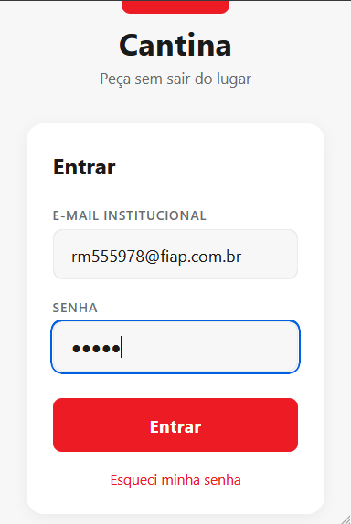
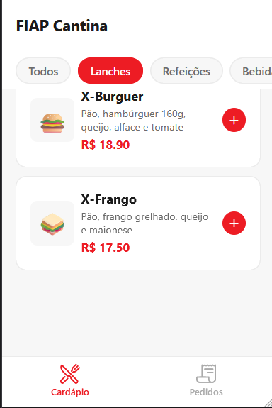
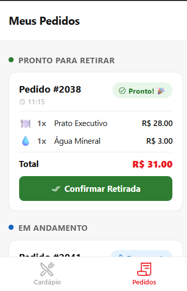

# 🍔 FIAP Cantina

> Aplicativo mobile de pedidos para a cantina da FIAP, desenvolvido com React Native e Expo.

---

## 📋 Sobre o Projeto

### O Problema
Filas na cantina durante o intervalo são um problema recorrente na FIAP. Alunos perdem tempo esperando para fazer e retirar pedidos, especialmente nos períodos de maior movimento entre as aulas.

### A Solução
O **FIAP Cantina** é um aplicativo mobile que permite ao aluno visualizar o cardápio, montar seu pedido e acompanhar o status em tempo real — sem precisar ficar na fila. O pedido fica pronto quando o aluno chegar ao balcão.

### Operação Escolhida
**Cantina** — A cantina é o ponto de maior concentração de alunos fora de sala e onde gargalos de atendimento são mais visíveis. A digitalização do processo de pedido traz ganho imediato de experiência para o aluno e eficiência para a operação.

### Funcionalidades Implementadas

- **Autenticação** — Login com e-mail institucional e senha
- **Cardápio** — Listagem de itens com nome, descrição, preço e categoria
- **Filtro por categoria** — Lanches, Refeições, Bebidas, Sobremesas
- **Carrinho dinâmico** — Adição e remoção de itens com contagem e total em tempo real
- **Botão de pedido flutuante** — Aparece ao adicionar itens, exibe total e acesso rápido
- **Pedidos abertos** — Listagem dos pedidos do aluno com status atual
- **Status de pedido** — Aguardando, Preparando e Pronto para retirar
- **Confirmação de retirada** — Botão para marcar pedido como retirado

---

## 👥 Integrantes do Grupo

| Nome completo | RM |
|---|---|
- Glauco Gonçalves - RM 555978

---

## 🚀 Como Rodar o Projeto

### Pré-requisitos

- [Node.js](https://nodejs.org/) v18 ou superior
- [Git](https://git-scm.com/)
- Aplicativo **Expo Go** instalado no celular ([Android](https://play.google.com/store/apps/details?id=host.exp.exponent) / [iOS](https://apps.apple.com/app/expo-go/id982107779))
- **ou** Android Studio / Xcode para rodar em emulador

### Passo a Passo

```bash
# 1. Clone o repositório
git clone https://github.com/<!-- seu-usuario -->/fiap-cantina.git

# 2. Entre na pasta do projeto
cd fiap-cantina

# 3. Instale as dependências
npm install

# 4. Inicie o servidor de desenvolvimento
npx expo start
```

Após iniciar, um **QR code** aparecerá no terminal. Escaneie com o aplicativo Expo Go (Android) ou com a câmera do iPhone (iOS) para abrir o app no seu dispositivo.

Para rodar no emulador, pressione `a` (Android) ou `i` (iOS) no terminal após o servidor iniciar.

---

## 📱 Demonstração

### Telas do Aplicativo

> ⚠️ _Adicione abaixo os prints de cada tela. Sugestão: arraste as imagens direto para o repositório no GitHub._

#### Tela de Login
<!--  -->

#### Cardápio
<!--  -->

#### Pedidos Abertos
<!--  -->

### Vídeo / GIF de Demonstração

> 🎥 _Grave o fluxo principal (login → montar pedido → ver pedidos) e adicione o link abaixo._  
> _Para GIF: use o Android Studio (emulador → Record Screen). Para vídeo: grave a tela e suba no YouTube ou Google Drive._

<!-- [▶️ Assistir demonstração](https://link-do-video-aqui) -->

---

## 🏗️ Decisões Técnicas

### Estrutura do Projeto

O projeto utiliza **Expo Router** com roteamento baseado em arquivos, seguindo a convenção de pastas do framework:

```
app/
├── _layout.tsx          # Root layout — Stack navigator
├── index.tsx            # Ponto de entrada — redireciona para /login
├── login.tsx            # Tela de autenticação
└── (tabs)/
    ├── _layout.tsx      # Tab Bar com as abas principais
    ├── cardapio.tsx     # Aba de montagem do pedido
    └── pedidos.tsx      # Aba de pedidos abertos
constants/
└── theme.ts             # Tokens de design (cores, espaçamentos, bordas)
```

A pasta `(tabs)` usa a convenção de **route groups** do Expo Router, o que permite aplicar o layout de Tab Bar apenas às telas internas sem afetar o login.

### Hooks Utilizados

| Hook | Onde | Finalidade |
|---|---|---|
| `useState` | `login.tsx` | Controla os campos de e-mail, senha, loading e mensagem de erro |
| `useState` | `cardapio.tsx` | Gerencia a categoria selecionada e o estado do carrinho (objeto indexado por ID do item) |
| `useState` | `pedidos.tsx` | Mantém a lista de pedidos mockados |
| `useRouter` | `login.tsx`, `cardapio.tsx` | Navegação programática entre telas via `router.replace` e `router.push` |

### Navegação

A navegação foi organizada em dois níveis:

1. **Stack (raiz)** — gerencia a transição entre o fluxo de autenticação (`/login`) e a área logada (`/(tabs)`)
2. **Tabs (área logada)** — Tab Bar na parte inferior com as abas **Cardápio** e **Pedidos**

O redirecionamento inicial (`index.tsx → /login`) simula onde futuramente entraria a verificação de token de sessão.

---

## 🔮 Próximos Passos

Com mais tempo de desenvolvimento, o grupo implementaria:

- **Autenticação real** com JWT e integração à base de alunos da FIAP
- **Backend e API REST** para persistência de pedidos e cardápio dinâmico
- **Pagamento in-app** via PIX ou créditos do aluno
- **Notificações push** para avisar quando o pedido estiver pronto
- **Histórico de pedidos** com filtro por data
- **Painel para a cantina** (versão web ou tablet) para gerenciar os pedidos recebidos
- **Avaliação de pedidos** para o aluno dar feedback sobre os itens

---

<p align="center">
  Desenvolvido para a disciplina de Mobile Development — FIAP 2025
</p>